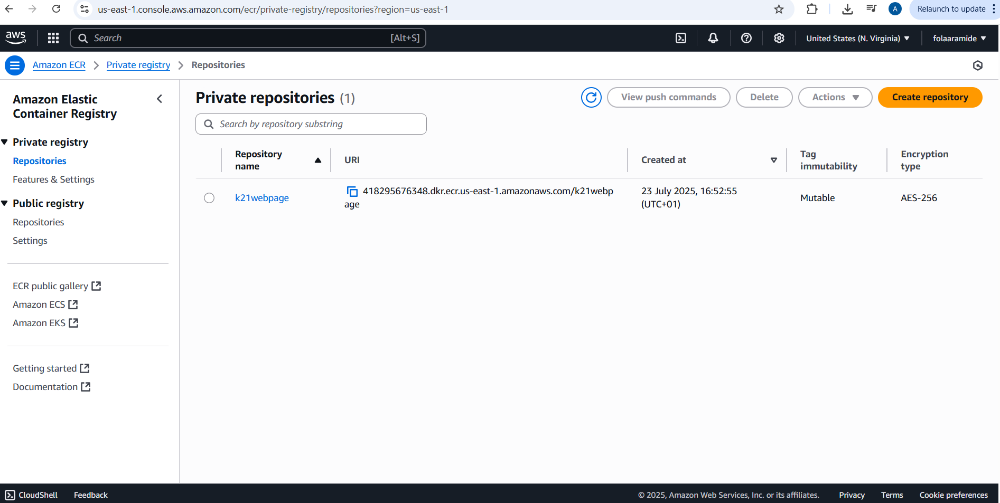
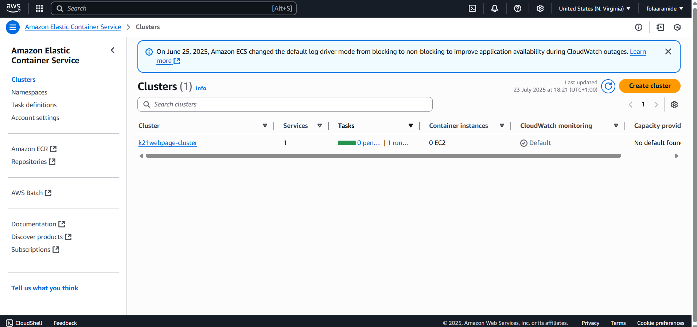
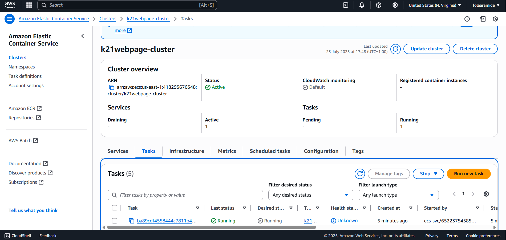
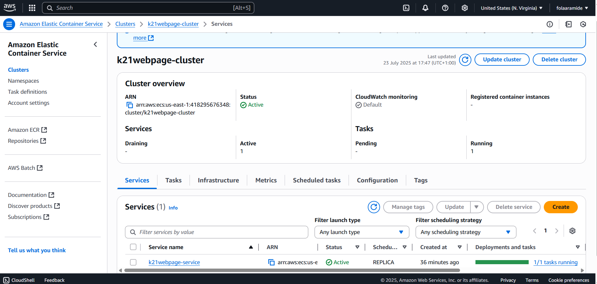
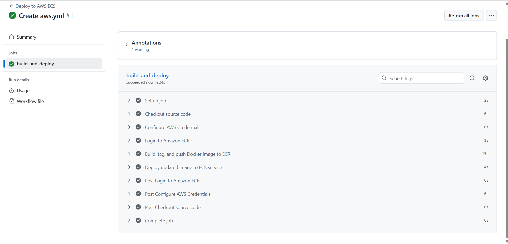
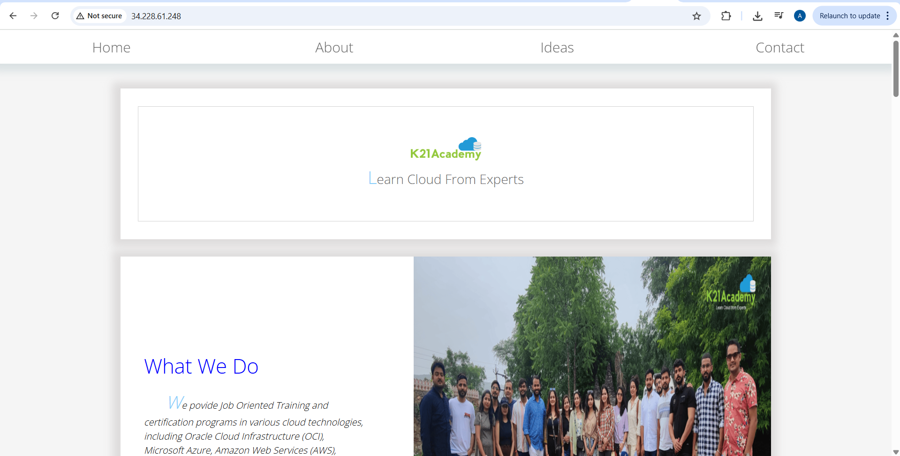
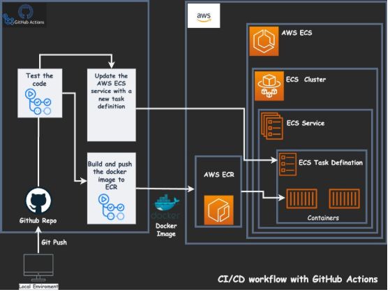

# 🚀 Automated CI/CD Pipeline for Web Application Deployment on AWS ECS (Fargate) using GitHub Actions
As a DevOps Engineer at K21Academy, I implemented an automated CI/CD pipeline for a web application that required frequent updates and fast delivery. The goal was to replace a slow, manual deployment process with a fully automated system that could ensure consistency, reduce risk, and improve release velocity.

This project reflects my ability to design and implement cloud-native DevOps workflows aligned with modern software delivery practices and business goals.

## 📌 Project Overview
The web application was under active development, and deployments were becoming increasingly error-prone and time-consuming. We needed a solution that could:

Eliminate manual steps

Ensure reliability and repeatability

Support faster, continuous deployments

Scale without managing underlying infrastructure

I designed and deployed an automated CI/CD pipeline using:

GitHub Actions for orchestrating the build and deployment steps

Docker for containerizing the application

Amazon ECR for storing container images securely

Amazon ECS with Fargate to run containers without managing servers

## 🎯 Objectives & Outcomes
✅ Objective: Streamline the deployment process using CI/CD on AWS.

✅ Result: A production-ready, fully automated deployment pipeline triggered by any push to the main branch.

Key results:

Deployment time reduced from ~30 minutes to under 5 minutes

No manual steps required from code commit to live deployment

Enabled developers to ship updates more frequently and confidently

All infrastructure defined and secured through automation and IAM best practices

## 🧱 Technologies Used
Docker – Containerized the web app for portability and consistency

Amazon ECR – Hosted versioned Docker images securely

Amazon ECS (Fargate) – Deployed containers without server management

GitHub Actions – Automated build, test, and deploy steps on code push

AWS IAM – Secured access for GitHub to interact with AWS services

## 🗂️ Key Components I Built
🔹 Docker Image
Created a Dockerfile to package the web application and its dependencies, ensuring environment consistency from dev to production.

🔹 ECR Repository
Provisioned an Amazon ECR repository and configured it to store versioned images of the application.

🔹 ECS Cluster + Fargate

Defined:

Task Definitions with resource configurations and image URI from ECR

ECS Services to maintain desired task count (auto-healing and rolling updates)

All running on AWS Fargate, eliminating the need to manage EC2 instances.

🔹 GitHub Actions Workflow

I used a GitHub Actions workflow file defined in .github/workflows/aws.yml, which automates:

Building the Docker image

Logging in to Amazon ECR

Pushing the image to ECR

Updating the ECS Task Definition and Service

Deploying the updated application via Fargate

The initial version of this workflow was provided by K21Academy as part of internal DevOps standards and was integrated and adapted into this project’s CI/CD pipeline.

## 🧠 Project Architecture

## 🔐 Security Considerations
Used GitHub Secrets to store AWS credentials securely

Applied least privilege IAM policies for ECR and ECS access

Avoided hardcoding any secrets or identifiers in the workflow file

## 💡 Learnings & Impact
This project helped reinforce my understanding of:

End-to-end CI/CD pipeline design

Infrastructure-as-Code vs. Console-based provisioning trade-offs

Event-driven automation using GitHub Actions

Practical cloud-native DevOps workflows with AWS services

It also highlighted the real-world value of automating deployments:

Less downtime

Higher team velocity

Better developer experience

Greater reliability and traceability in production releases

## 🧹 Resource Cleanup
After testing and validating the deployment, I performed a cleanup to avoid unnecessary charges:

Deleted the ECR repository

Removed the ECS service and cluster

Terminated related networking and IAM resources

## 📣 Final Thoughts
This project reflects my ability to apply DevOps principles to solve practical challenges in a cloud environment. It also showcases how CI/CD can transform a team’s development workflow, enabling faster, safer, and scalable software delivery.

